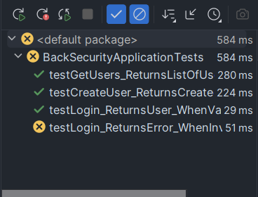

# TALLER 6 -  IMPLEMENTACIÓN DE UN SERVIDOR CON CERTIFICADO SSL EN AWS

---

## Resumen del Proyecto

Este proyecto nos permite crear un login con certificado SSL en AWS, para ello desarrollamos una aplicación de login con 
unos usuarios precargados en una base de datos.
- Se puede loggear con un usuario y contraseña.
- Notifica si no se ha ingresado un usuario o contraseña valido.
- Consulta los usuarios exsistentes en la base de datos.

---

## Arquitectura de la Solución

La arquitectura de la solución se basa en la creación de una instancia EC2 en AWS, en la cual se instala un servidor web Apache y se configura un certificado SSL para permitir la conexión segura a la aplicación de login.

- ***Frontend:*** Se desarrolla una aplicación web en HTML y JavaScript que permite a los usuarios ingresar un usuario y contraseña para autenticarse en la aplicación.
- ***Backend:*** Se desarrolla un servidor web en **SpringBoot** que recibe las peticiones de los usuarios y valida el usuario y contraseña ingresados, ademas de devolver todos los usuarios.
- ***Base de Datos:*** Se utiliza una base de datos **MySQL** para almacenar los usuarios y contraseñas de la aplicación.
- ***AWS:*** Se utilizan los servicios de **EC2** para la creación de una instancia para cada uno de los servicios anteriores.
---

### Componentes del Sistema

- El **frontend** envía solicitudes HTTP al **backend** mediante Fetch API.
- El **backend** procesa estas solicitudes a través de controladores que interactúan con la **base de datos** utilizando JPA/Hibernate.
- El **backend** devuelve las respuestas al **frontend**, actualizando dinámicamente la interfaz del usuario.
---

## Diseño de Clases

Las clases principales del sistema incluyen:

1. ***UserEntity***: Clase que representa un usuario con atributos como `id`, `email`, `username`, `password` y `role`.
2. ***UserDTO***: Clase que representa un usuario con atributos como `email`, `username`, `password` y `role`.
2. ***RoleEntity***: Enum que representa los roles de los usuarios.
2. ***UserService***: Servicio que contiene la lógica de negocio para las validación de los usuarios y obtendición de ellos.
3. ***UserController***: Controlador REST encargado de gestionar las solicitudes HTTP.
4. ***UserRepository***: Repositorio que maneja las operaciones directas con la base de datos.
---

## Ejecución del Proyecto
### Requisitos:
* __Java__: Version 11 o superior.
* __JDK__: kit de desarrollo de java- versión 8 o superior.
* __Browser__: Cualquier navegador para abrir la aplicación web.
* __Maven__: Para compilar el proyecto.
* __Docker__: Para ejecutar la base de datos MySQL en un contenedor cuando lo corramos en local.

> [!IMPORTANT]
> En este proyecto se utilizo la versión de Java 17 y Maven 3.9.5
---

## Instalación

* Primero, descarga el proyecto:

    ```bash
    git clone https://github.com/SebZaUr/Taller6-AREP.git
    ```

* Entra en el directorio del proyecto:

    ```bash
    cd Taller6-AREP
    ```

* Para la ejecución de la base de datos la vamos a desplegar desde el docker compose, para esto ejecutamos el siguiente comando:

    ```bash
    docker-compose up
    ```

* Compila el proyecto usando Maven:

    ```bash
    mvn clean install
    ```

* Ejecuta el proyecto:

    ```bash
    mvn spring-boot:run
    ```

* Para ingresar al proyecto le puedes dar click al siguiente enlace: [Click aqui](http://localhost:8080/)
---

## Pruebas Unitarias

### 1. `testGetUsers_ReturnsListOfUsers`

- **Descripción**: Esta prueba verifica que el endpoint `/api/user/users` devuelve una lista de usuarios correctamente.
- **Pasos**:
  - Se prepara una lista con un único usuario (`UserEntity`).
  - Se simula la llamada al servicio de usuario (`userService.getAll()`) para devolver esta lista.
  - Se realiza una solicitud `GET` al endpoint y se comprueba que el estado de respuesta sea `200 OK`.

### 2. `testCreateUser_ReturnsCreatedUser`

- **Descripción**: Esta prueba verifica que el endpoint para la creación de un usuario (`/api/user/create`) crea correctamente un usuario y devuelve una respuesta con estado `201 Created`.
- **Pasos**:
  - Se crea un objeto `UserDTO` con los datos del usuario a crear.
  - Se simula la creación del usuario en el servicio (`userService.save()`), retornando un objeto `UserEntity` con un ID y una contraseña cifrada.
  - Se realiza una solicitud `POST` al endpoint con el JSON de los datos del usuario, y se comprueba que el estado de respuesta sea `201 Created`.

### 3. `testLogin_ReturnsUser_WhenValidCredentials`

- **Descripción**: Esta prueba verifica que el login de usuario con credenciales válidas devuelve el usuario autenticado correctamente.
- **Pasos**:
  - Se crea un objeto `UserDTO` con las credenciales del usuario.
  - Se simula la búsqueda del usuario con el servicio (`userService.getUser()`), que devuelve una lista con el usuario encontrado.
  - Se realiza una solicitud `POST` al endpoint `/api/user/login` con las credenciales en formato JSON y se verifica que la respuesta tenga un estado `200 OK`.

### 4. `testLogin_ReturnsError_WhenInvalidCredentials`

- **Descripción**: Esta prueba verifica que el login con credenciales inválidas devuelve un error apropiado.
- **Pasos**:
  - Se crea un objeto `UserDTO` con credenciales incorrectas (contraseña incorrecta).
  - Se simula que el servicio de usuario (`userService.getUser()`) lanza una excepción indicando que la contraseña es incorrecta.
  - Se realiza una solicitud `POST` al endpoint `/api/user/login` con las credenciales incorrectas en formato JSON y se comprueba que la respuesta tenga un estado de error `500 Internal Server Error`.

### Ejecución de Pruebas



---

## Despliegue en AWS

[Video ejecución en AWS](https://youtu.be/JI1w7SH1yrk)

---
## Licencia
Este proyecto está bajo la licencia de Creative Commons Reconocimiento-CompartirIgual 4.0 Internacional (CC BY-SA 4.0) - Ver el archivo [LICENSE](LICENSE.md) para más detalles.

---
## Autor:
* __Sebastian Zamora Urrego__